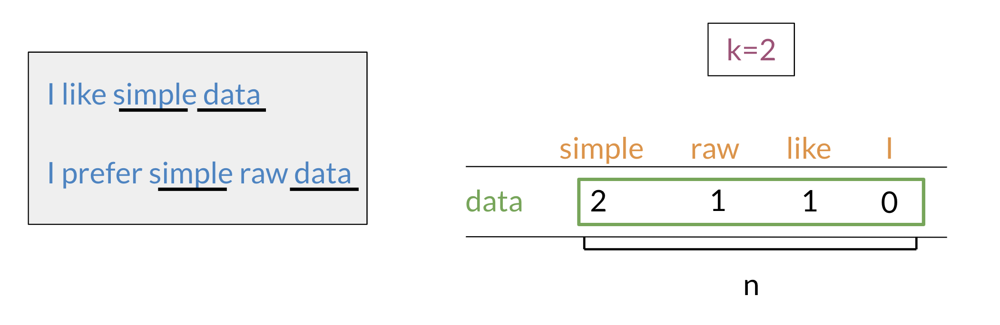

# Word by Word and Word by Doc

## Word by Word Design

We will start by exploring the word by word design. Assume that you are trying to come up with a vector that will represent a certain word.  One possible design would be to create a matrix where each row and column corresponds to a word in your vocabulary. Then you can iterate over a document and see the number of times each word shows up next each other word. You can keep track of the number in the matrix. In the video I spoke about a parameter KK. You can think of KK as the bandwidth that decides whether two words are next to each other or not.

In the example above, you can see how we are keeping track of the number of times words occur together within a certain distance kk. At the end, you can represent the word data, as a vector v = [2,1,1,0]v=[2,1,1,0].

## Word by Document Design

You can now apply the same concept and map words to documents. The rows could correspond to words and the columns to documents. The numbers in the matrix correspond to the number of times each word showed up in the document.

You can represent the entertainment category, as a vector v = [500, 7000]v=[500,7000]. You can then also compare categories as follows by doing a simple plot.

Later this week, you will see how you can use the angle between two vectors to measure similarity.
