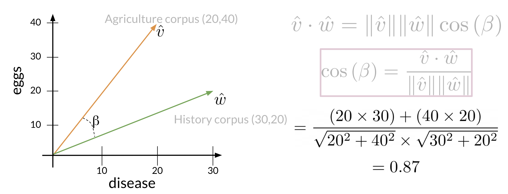

## Cosine Similarity

Before getting into the cosine similarity function remember that the norm of a vector is defined as:

$$ \| \vec{v} \| = \sqrt{\sum_{i=1}^{n} |v_i|^2 } $$

The **dot product** is then defined as:
$$\vec{v} \cdot \vec{w} = \sum_{i=1}^{n} v_i \cdot w_i $$
​

The following cosine similarity equation makes sense:
$$\cos (\beta) = \frac{\hat v \cdot \hat w}{\| \hat v \| \| \hat w \|}$$

If $\hat v$ and $\hat w$ are the same then you get the numerator to be equal to the denominator. Hence $\beta = 0$. On the other hand, the dot product of two orthogonal (perpendicular) vectors is $0$. That takes place when $\beta = 90$.

