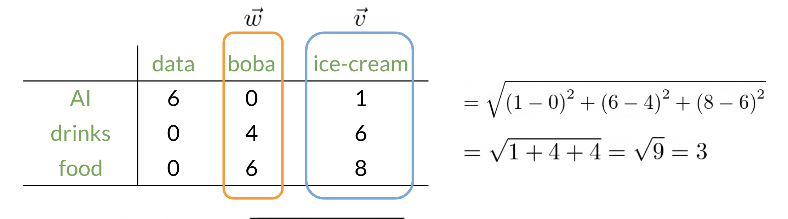

# NLP with Classification and Vector Spaces

## Table of contents

- [Table of contents](#table-of-contents)
- [Course Summary](#course-summary)
- [Vector Space Models](#vector-space-models)
- [Word by Word and Word by Doc](#word-by-word-and-word-by-doc)
  - [Word by Word Design](#word-by-word-design)
  - [Word by Document Design](#word-by-document-design)
- [Euclidian Distance](#euclidian-distance)
- [Cosine Similarity: Intuition](#cosine-similarity-intuition)
- [Cosine Similarity](#cosine-similarity)
- [Manipulating Words in Vector Spaces](#manipulating-words-in-vector-spaces)
- [Visualization and PCA](#visualization-and-pca)

## Course Summary

## Vector Space Models

[top](#table-of-contents)

Vector spaces are fundamental in many applications in NLP. If you were to represent a word, document, tweet, or any form of text, you will probably be encoding it as a vector. These vectors are important in tasks like information extraction, machine translation, and chatbots. Vector spaces could also be used to help you identify relationships between words as follows:

The famous quote by Firth says, **"You shall know a word by the company it keeps"**. When learning these vectors, you usually make use of the neighboring words to extract meaning and information about the center word. If you were to cluster these vectors together, as you will see later in this specialization, you will see that adjectives, nouns, verbs, etc. tend to be near one another. Another cool fact, is that synonyms and antonyms are also very close to one another. This is because you can easily interchange them in a sentence and they tend to have similar neighboring words!

## Word by Word and Word by Doc

### Word by Word Design

We will start by exploring the word by word design. Assume that you are trying to come up with a vector that will represent a certain word.  One possible design would be to create a matrix where each row and column corresponds to a word in your vocabulary. Then you can iterate over a document and see the number of times each word shows up next each other word. You can keep track of the number in the matrix. In the video I spoke about a parameter KK. You can think of KK as the bandwidth that decides whether two words are next to each other or not.

In the example above, you can see how we are keeping track of the number of times words occur together within a certain distance kk. At the end, you can represent the word data, as a vector v = [2,1,1,0]v=[2,1,1,0].

### Word by Document Design

You can now apply the same concept and map words to documents. The rows could correspond to words and the columns to documents. The numbers in the matrix correspond to the number of times each word showed up in the document.

You can represent the entertainment category, as a vector v = [500, 7000]v=[500,7000]. You can then also compare categories as follows by doing a simple plot.

Later this week, you will see how you can use the angle between two vectors to measure similarity.

## Euclidian Distance

Let us assume that you want to compute the distance between two points: $A, B$. To do so, you can use the euclidean distance defined as

$d(B,A) = \sqrt{(B_1 − A_1)^2 +(B_2 − A_2)^2}$

​

You can generalize finding the distance between the two points $(A,B)$ to the distance between an nn dimensional vector as follows:

​$d(\vec{v}, \vec{w}) = \sqrt{ \sum_{i=1}^{n} (v_i - w_i)^2}$

Here is an example where I calculate the distance between 2 vectors $(n=3)$.

## Cosine Similarity: Intuition

One of the issues with euclidean distance is that it is not always accurate and sometimes we are not looking for that type of similarity metric. For example, when comparing large documents to smaller ones with euclidean distance one could get an inaccurate result. Look at the diagram below:

Normally the **food** corpus and the **agriculture** corpus are more similar because they have the same proportion of words. However the food corpus is much smaller than the agriculture corpus. To further clarify, although the history corpus and the agriculture corpus are different, they have a smaller euclidean distance. Hence $d_2 < d_1$

To solve this problem, we look at the cosine between the vectors. This allows us to compare $\beta$ and $\alpha$.

## Cosine Similarity

Before getting into the cosine similarity function remember that the norm of a vector is defined as:

$$ \| \vec{v} \| = \sqrt{\sum_{i=1}^{n} |v_i|^2 } $$

The **dot product** is then defined as:
$$\vec{v} \cdot \vec{w} = \sum_{i=1}^{n} v_i \cdot w_i $$
​

The following cosine similarity equation makes sense:
$$\cos (\beta) = \frac{\hat v \cdot \hat w}{\| \hat v \| \| \hat w \|}$$

If $\hat v$ and $\hat w$ are the same then you get the numerator to be equal to the denominator. Hence $\beta = 0$. On the other hand, the dot product of two orthogonal (perpendicular) vectors is $0$. That takes place when $\beta = 90$.

## Manipulating Words in Vector Spaces

## Visualization and PCA
