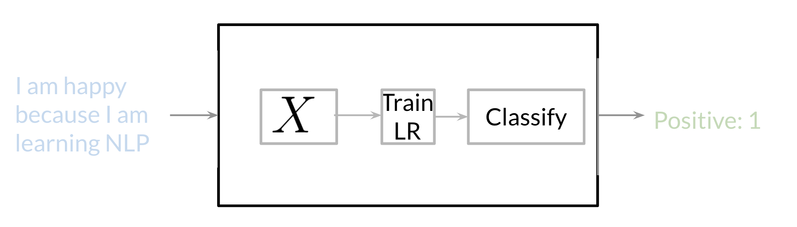
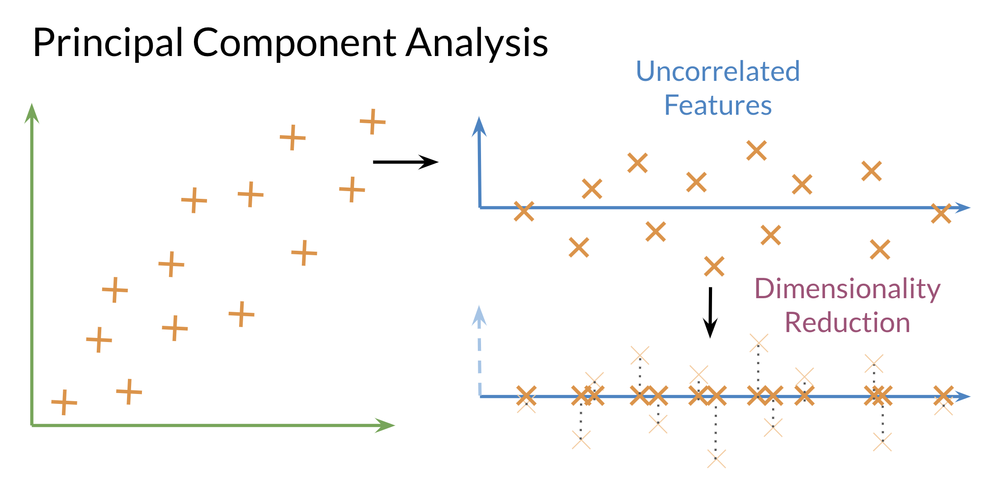
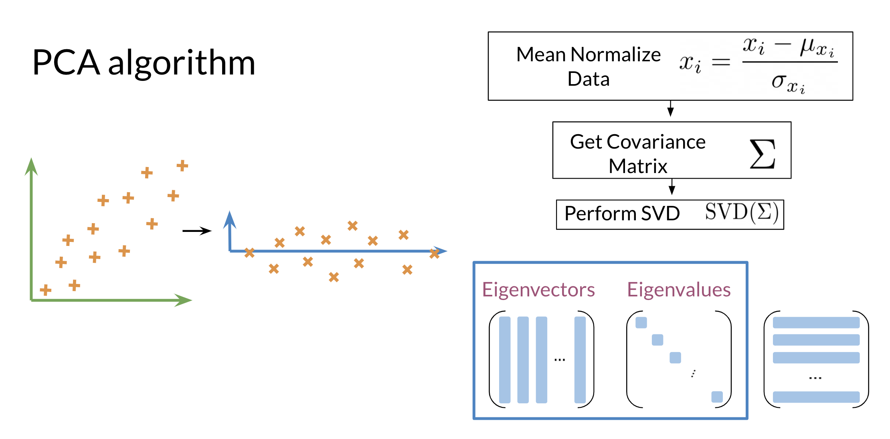

# NLP with Classification and Vector Spaces

## Table of contents

- [Table of contents](#table-of-contents)
- [About this course](#about-this-course)
- [Supervised ML \& Sentiment Analysis](#supervised-ml--sentiment-analysis)
- [Vocabulary \& Feature Extraction](#vocabulary--feature-extraction)
- [Feature Extraction with Frequencies](#feature-extraction-with-frequencies)
- [Preprocessing](#preprocessing)
- [LAB - Natural Language preprocessing](#lab---natural-language-preprocessing)
- [Vector Space Models](#vector-space-models)
- [Word by Word and Word by Doc](#word-by-word-and-word-by-doc)
  - [Word by Word Design](#word-by-word-design)
  - [Word by Document Design](#word-by-document-design)
- [LAB - Linear algebra in Python with Numpy](#lab---linear-algebra-in-python-with-numpy)
- [Euclidian Distance](#euclidian-distance)
- [Cosine Similarity: Intuition](#cosine-similarity-intuition)
- [Cosine Similarity](#cosine-similarity)
- [Manipulating Words in Vector Spaces](#manipulating-words-in-vector-spaces)
- [LAB - Manipulating word embeddings](#lab---manipulating-word-embeddings)
- [Visualization and PCA](#visualization-and-pca)
- [PCA algorithm](#pca-algorithm)
- [LAB - Another explanation about PCA](#lab---another-explanation-about-pca)
- [Transforming word vectors](#transforming-word-vectors)
- [LAB - Vector manipulation in Python](#lab---vector-manipulation-in-python)
- [K-nearest neighbors](#k-nearest-neighbors)
- [Hash tables and hash functions](#hash-tables-and-hash-functions)
- [LAB - Hash functions and multiplanes](#lab---hash-functions-and-multiplanes)

## About this course

[back to TOC](#table-of-contents)

In Course 1 of the Natural Language Processing Specialization, you will:

1. Perform sentiment analysis of tweets using logistic regression and then naïve Bayes
2. Use vector space models to discover relationships between words and use PCA to reduce the dimensionality of the vector space and visualize those relationships
3. Write a simple English to French translation algorithm using pre-computed word embeddings and locality-sensitive hashing to relate words via approximate k-nearest neighbor search.  

By the end of this Specialization, you will have designed NLP applications that perform question-answering and sentiment analysis, created tools to translate languages and summarize text, and even built a chatbot!

This Specialization is designed and taught by two experts in NLP, machine learning, and deep learning. Younes Bensouda Mourri is an Instructor of AI at Stanford University who also helped build the Deep Learning Specialization. Łukasz Kaiser is a Staff Research Scientist at Google Brain and the co-author of Tensorflow, the Tensor2Tensor and Trax libraries, and the Transformer paper.

## Supervised ML & Sentiment Analysis

[back to TOC](#table-of-contents)

In supervised machine learning, you usually have an input $X$, which goes into your prediction function to get your $\hat Y$. You can then compare your prediction with the true value $Y$. This gives you your cost which you use to update the parameters $\theta$. The following image, summarizes the process.

To perform sentiment analysis on a tweet, you first have to represent the text (i.e. "I am happy because I am learning NLP ") as features, you then train your logistic regression classifier, and then you can use it to classify the text.

Note that in this case, you either classify 1, for a positive sentiment, or 0, for a negative sentiment.

## Vocabulary & Feature Extraction

[back to TOC](#table-of-contents)

Given a tweet, or some text, you can represent it as a vector of dimension $V$, where $V$ corresponds to your vocabulary size. If you had the tweet "I am happy because I am learning NLP", then you would put a 1 in the corresponding index for any word in the tweet, and a 0 otherwise.

As you can see, as $V$ gets larger, the vector becomes more sparse. Furthermore, we end up having many more features and end up training $\theta$ $V$ parameters. This could result in larger training time, and large prediction time.

## Feature Extraction with Frequencies

[back to TOC](#table-of-contents)

Given a corpus with positive and negative tweets as follows:

You have to encode each tweet as a vector. Previously, this vector was of dimension $V$. Now, as you will see in the upcoming videos, you will represent it with a vector of dimension $3$. To do so, you have to create a dictionary to map the word, and the class it appeared in (positive or negative) to the number of times that word appeared in its corresponding class.

In the past two videos, we call this dictionary `freqs`. In the table above, you can see how words like happy and sad tend to take clear sides, while other words like "I, am" tend to be more neutral. Given this dictionary and the tweet, "I am sad, I am not learning NLP", you can create a vector corresponding to the feature as follows:

To encode the negative feature, you can do the same thing.

Hence you end up getting the following feature vector $[1,8,11]$. $1$ corresponds to the bias, $8$ the positive feature, and $11$ the negative feature.

## Preprocessing

[back to TOC](#table-of-contents)

When preprocessing, you have to perform the following:

1. Eliminate handles and URLs
2. Tokenize the string into words.
3. Remove stop words like "and, is, a, on, etc."
4. Stemming- or convert every word to its stem. Like dancer, dancing, danced, becomes 'danc'. You can use porter stemmer to take care of this.
5. Convert all your words to lower case.

For example the following tweet "@YMourri and @AndrewYNg are tuning a GREAT AI model at <https://deeplearning.ai>!!!" after preprocessing becomes

$[tun, great, ai, model]$. Hence you can see how we eliminated handles, tokenized it into words, removed stop words, performed stemming, and converted everything to lower case.

## LAB - Natural Language preprocessing

[back to TOC](#table-of-contents)

In this [lab](Labs/Week%201/C1_W1_lecture_nb_01_preprocessing.ipynb), we will be exploring how to preprocess tweets for sentiment analysis. We will provide a function for preprocessing tweets during this week's assignment, but it is still good to know what is going on under the hood. By the end of this lecture, you will see how to use the [NLTK](http://www.nltk.org) package to perform a preprocessing pipeline for Twitter datasets.

## Vector Space Models

[back to TOC](#table-of-contents)

Vector spaces are fundamental in many applications in NLP. If you were to represent a word, document, tweet, or any form of text, you will probably be encoding it as a vector. These vectors are important in tasks like information extraction, machine translation, and chatbots. Vector spaces could also be used to help you identify relationships between words as follows:

The famous quote by Firth says, **"You shall know a word by the company it keeps"**. When learning these vectors, you usually make use of the neighboring words to extract meaning and information about the center word. If you were to cluster these vectors together, as you will see later in this specialization, you will see that adjectives, nouns, verbs, etc. tend to be near one another. Another cool fact, is that synonyms and antonyms are also very close to one another. This is because you can easily interchange them in a sentence and they tend to have similar neighboring words!

## Word by Word and Word by Doc

[back to TOC](#table-of-contents)

### Word by Word Design

We will start by exploring the word by word design. Assume that you are trying to come up with a vector that will represent a certain word.  One possible design would be to create a matrix where each row and column corresponds to a word in your vocabulary. Then you can iterate over a document and see the number of times each word shows up next each other word. You can keep track of the number in the matrix. In the video I spoke about a parameter KK. You can think of KK as the bandwidth that decides whether two words are next to each other or not.

In the example above, you can see how we are keeping track of the number of times words occur together within a certain distance kk. At the end, you can represent the word data, as a vector $v = [2,1,1,0]$.

### Word by Document Design

You can now apply the same concept and map words to documents. The rows could correspond to words and the columns to documents. The numbers in the matrix correspond to the number of times each word showed up in the document.

You can represent the entertainment category, as a vector $v = [500, 7000]$. You can then also compare categories as follows by doing a simple plot.

Later this week, you will see how you can use the angle between two vectors to measure similarity.

## LAB - Linear algebra in Python with Numpy

[back to TOC](#table-of-contents)

Please go through this [lecture notebook](Labs/Week%203/C1_W3_lecture_nb_01_linear_algebra.ipynb) to practice about the basic linear algebra concepts in Python using a very powerful library called **Numpy**. This will help prepare you for the graded assignment at the end of this week.

## Euclidian Distance

[back to TOC](#table-of-contents)

Let us assume that you want to compute the distance between two points: $A, B$. To do so, you can use the euclidean distance defined as

$$
d(B,A) = \sqrt{(B_1 − A_1)^2 +(B_2 − A_2)^2}
$$

​

You can generalize finding the distance between the two points $(A,B)$ to the distance between an nn dimensional vector as follows:

$$
​d(\vec{v}, \vec{w}) = \sqrt{\sum_{i=1}^{n} (v_i - w_i)^2}
$$

Here is an example where I calculate the distance between 2 vectors $(n=3)$.

## Cosine Similarity: Intuition

[back to TOC](#table-of-contents)

One of the issues with euclidean distance is that it is not always accurate and sometimes we are not looking for that type of similarity metric. For example, when comparing large documents to smaller ones with euclidean distance one could get an inaccurate result. Look at the diagram below:

Normally the **food** corpus and the **agriculture** corpus are more similar because they have the same proportion of words. However the food corpus is much smaller than the agriculture corpus. To further clarify, although the history corpus and the agriculture corpus are different, they have a smaller euclidean distance. Hence $d_2 < d_1$

To solve this problem, we look at the cosine between the vectors. This allows us to compare $\beta$ and $\alpha$.

## Cosine Similarity

[back to TOC](#table-of-contents)

Before getting into the cosine similarity function remember that the norm of a vector is defined as:

$$
\| \vec{v} \| = \sqrt{\sum_{i=1}^{n} |v_i|^2 }
$$

The **dot product** is then defined as:
$$
\vec{v} \cdot \vec{w} = \sum_{i=1}^{n} v_i \cdot w_i
$$
​

The following cosine similarity equation makes sense:
$$
\cos (\beta) = \frac{\hat v \cdot \hat w}{\| \hat v \| \| \hat w \|}
$$

If $\hat v$ and $\hat w$ are the same then you get the numerator to be equal to the denominator. Hence $\beta = 0$. On the other hand, the dot product of two orthogonal (perpendicular) vectors is $0$. That takes place when $\beta = 90$.

## Manipulating Words in Vector Spaces

[back to TOC](#table-of-contents)

You can use word vectors to actually extract patterns and identify certain structures in your text. For example:

You can use the word vector for Russia, USA, and DC to actually compute a **vector** that would be very similar to that of Moscow. You can then use cosine similarity of the **vector** with all the other word vectors you have and you can see that the vector of Moscow is the closest.

Note that the distance (and direction) between a country and its capital is relatively the same. Hence manipulating word vectors allows you identify patterns in the text.

## LAB - Manipulating word embeddings

[back to TOC](#table-of-contents)

Please go through this [lecture notebook](Labs/Week%203/C1_W3_lecture_nb_02_manipulating_word_embeddings.ipynb) to apply the linear algebra concepts for the manipulation of word embeddings. This will help prepare you for the graded assignment at the end of this week.

## Visualization and PCA

[back to TOC](#table-of-contents)

Principal component analysis is an unsupervised learning algorithm which can be used to reduce the dimension of your data. As a result, it allows you to visualize your data. It tries to combine variances across features. Here is a concrete example of PCA:

Note that when doing PCA on this data, you will see that oil & gas are close to one another and town & city are also close to one another. To plot the data you can use PCA to go from $d>2$ dimensions to $d=2$.

Those are the results of plotting a couple of vectors in two dimensions. Note that words with similar part of speech (POS) tags are next to one another. This is because many of the training algorithms learn words by identifying the neighboring words. Thus, words with similar POS tags tend to be found in similar locations. An interesting insight is that synonyms and antonyms tend to be found next to each other in the plot. Why is that the case?

## PCA algorithm

[back to TOC](#table-of-contents)

PCA is commonly used to reduce the dimension of your data. Intuitively the model collapses the data across principal components. You can think of the first principal component (in a 2D dataset) as the line where there is the most amount of variance. You can then collapse the data points on that line. Hence you went from 2D to 1D. You can generalize this intuition to several dimensions.

**Eigenvector**: the resulting vectors, also known as the uncorrelated features of your data

**Eigenvalue**: the amount of information retained by each new feature. You can think of it as the variance in the eigenvector.

Also each eigenvalue has a corresponding **eigenvector**. The eigenvalue tells you how much variance there is in the eigenvector. Here are the steps required to compute PCA:

**Steps to Compute PCA:**

- Mean normalize your data
- Compute the covariance matrix
- Compute SVD on your covariance matrix. This returns $[U S V] = svd[\Sigma]$. The three matrices U, S, V are drawn above. U is labelled with eigenvectors, and S is labelled with eigenvalues.

You can then use the first n columns of vector $U$, to get your new data by multiplying $XU[:, 0:n]$.

## LAB - Another explanation about PCA

[back to TOC](#table-of-contents)

In this [lab](Labs/Week%203/C1_W3_lecture_nb_03_pca.ipynb), we are going to view another explanation about Principal Component Analysis(PCA). PCA is a statistical technique invented in 1901 by Karl Pearson that uses orthogonal transformations to map a set of variables into a set of linearly uncorrelated variables called Principal Components.

PCA is based on the Singular Value Decomposition (SVD) of the Covariance Matrix of the original dataset. The Eigenvectors of such decomposition are used as a rotation matrix. The Eigenvectors are arranged in the rotation matrix in decreasing order according to its explained variance. This last term is related to the EigenValues of the SVD.

PCA is a potent technique with applications ranging from simple space transformation, dimensionality reduction, and mixture separation from spectral information.

Follow this lab to view another explanation for PCA. In this case, we are going to use the concept of rotation matrices applied to correlated random data, just as illustrated in the next picture.

## Transforming word vectors

[back to TOC](#table-of-contents)

In the previous week, I showed you how we can plot word vectors. Now, you will see how you can take a word vector and learn a mapping that will allow you to translate words by learning a "transformation matrix". Here is a visualization:

Note that the word "chat" in french means cat. You can learn that by taking the  vector corresponding to "cat" in english, multiplying it by a matrix that you learn and then you can use cosine similarity between the output and all the french vectors. You should see that the closest result is the vector which corresponds to "chat".

Here is a visualization of that showing you the aligned vectors:

Note that $X$ corresponds to the matrix of english word vectors and YY corresponds to the matrix of french word vectors. $R$ is the mapping matrix.

**Steps required to learn $R$:**

- Initialize R
- For loop

$$
Loss  = \| XR-Y \|_F
$$
$$
g = \frac{d}{dR} Loss
$$
$$
R = R- \alpha*g
$$

Here is an example to show you how the frobenius norm works.
$$
\begin{array}{l}\|\mathbf{X} \mathbf{R}-\mathbf{Y}\|_{F} \\ \mathbf{A}=\left(\begin{array}{ll}2 & 2 \\ 2 & 2\end{array}\right) \\ \left\|\mathbf{A}_{F}\right\|=\sqrt{2^{2}+2^{2}+2^{2}+2^{2}} \\ \left\|\mathbf{A}_{F}\right\|=4 \\ \|\mathbf{A}\|_{F} \equiv \sqrt{\sum_{i=1}^{m} \sum_{j=1}^{n}\left|a_{i j}\right|^{2}}\end{array}
$$
​
In summary you are making use of the following:
$$
\begin{array}{l}\bullet \mathrm{XR} \approx \mathrm{Y} \\ \bullet \text { minimize }\|\mathrm{XR}-\mathrm{Y}\|_{F}^{2}\end{array}
$$

## LAB - Vector manipulation in Python

[back to TOC](#table-of-contents)

In this [lab](Labs/Week%204/C1_W4_lecture_nb_01_vector_manipulation.ipynb), you will have the opportunity to practice once again with the NumPy library. This time, we will explore some advanced operations with arrays and matrices.

At the end of the previous module, we used PCA to transform a set of many variables into a set of only two uncorrelated variables. This process was made through a transformation of the data called rotation.

In this week's assignment, you will need to find a transformation matrix from English to French vector space embeddings. Such a transformation matrix is nothing else but a matrix that rotates and scales vector spaces.

In this notebook, we will explain in detail the rotation transformation.

## K-nearest neighbors

[back to TOC](#table-of-contents)

After you have computed the output of $XR$ you get a vector. You then need to find the most similar vectors to your output. Here is a visual example:

In the video, we mentioned if you were in San Francisco, and you had friends all over the world,  you would want to find the nearest neighbors. To do that it might be expensive to go over all the countries one at a time. So we will introduce hashing to show you how you can do a look up much faster.

## Hash tables and hash functions

[back to TOC](#table-of-contents)

Imagine you had to cluster the following figures into different buckets:

Note that the figures blue, red, and gray ones would each be clustered with each other

You can think of hash function as a function that takes data of arbitrary sizes and maps it to a fixed value. The values returned are known as *hash values* or even *hashes*.

The diagram above shows a concrete example of a hash function which takes a vector and returns a value. Then you can mod that value by the number of buckets and put that number in its corresponding bucket. For example, 14 is in the 4th bucker, 17 & 97 are in the 7th bucket. Let's take a look at how you can do it using some code.

The code snippet above creates a basic hash table which consists of hashed values inside their buckets. **hash_function** takes in *value_l* (a list of values to be hashed) and *n_buckets* and mods the value by the buckets. Now to create the *hash_table*, you first initialize a list to be of dimension *n_buckets* (each value will go to a bucket). For each value in your list of values, you will feed it into your **hash_function**, get the *hash_value*, and append it to the list of values in the corresponding bucket.

Now given an input, you don't have to compare it to all the other examples, you can just compare it to all the values in the same *hash_bucket* that input has been hashed to.

When hashing you sometimes want similar words or similar numbers to be hashed to the same bucket. To do this, you will use “locality sensitive hashing.”  Locality is another word for “location”.  So locality sensitive hashing is a hashing method that cares very deeply about assigning items based on where they’re located in vector space.

## LAB - Hash functions and multiplanes

[back to TOC](#table-of-contents)

In this [lab](Labs/Week%204/C1_W4_lecture_nb_02_hash_functions_and_multiplanes.ipynb), we are going to practice the most important concepts related to the hash functions explained in the videos. You will be using these in this week's assignment.

A key point for the lookup using hash functions is the calculation of the hash key or bucket id that we assign for a given entry. In this notebook, we will cover:

- Basic hash tables
- Multiplanes
- Random planes
