# Natural Language Processing with Probabilistic Model

[Link](https://www.coursera.org/learn/probabilistic-models-in-nlp?specialization=natural-language-processing)

## Table of contents

- [Table of contents](#table-of-contents)
- [About this course](#about-this-course)
- [Autocorrect and Dynamic Programming](#autocorrect-and-dynamic-programming)
- [Part of Speech Tagging and Hidden Markov Models](#part-of-speech-tagging-and-hidden-markov-models)
- [Autocomplete and Language Models](#autocomplete-and-language-models)
- [Word embeddings with neural networks](#word-embeddings-with-neural-networks)

## About this course

[back to TOC](#table-of-contents)

In Course 2 of the [Natural Language Processing Specialization](https://www.coursera.org/specializations/natural-language-processing), offered by deeplearning.ai, you will:

1. Create a simple auto-correct algorithm using minimum edit distance and dynamic programming
2. Apply the Viterbi Algorithm for part-of-speech (POS) tagging, which is important for computational linguistics,
3. Write a better auto-complete algorithm using an N-gram language model, and
4. Write your own Word2Vec model that uses a neural network to compute word embeddings using a continuous bag-of-words model.

By the end of this Specialization, you will have designed NLP applications that perform question-answering and sentiment analysis, created tools to translate languages and summarize text, and even built a chatbot!

This Specialization is designed and taught by two experts in NLP, machine learning, and deep learning. Younes Bensouda Mourri is an Instructor of AI at Stanford University who also helped build the Deep Learning Specialization. Łukasz Kaiser is a Staff Research Scientist at Google Brain and the co-author of Tensorflow, the Tensor2Tensor and Trax libraries, and the Transformer paper.

## Autocorrect and Dynamic Programming

[back to TOC](#table-of-contents)

### Autocorrect

You use auto-correct everyday. When you send your friend a text message, or when you make a mistake in a query, there is an autocorrect behind the scenes that corrects the sentence for you. This week you are also going to learn about minimum edit distance, which tells you the minimum amount of edits to change one word into another. In doing that, you will learn about dynamic programming which is an important programming concept which frequently comes up in interviews and could be used to solve a lot of optimization problems.

- Autocorrect is an application that changes misspelled words into the correct ones.
  - Example: Happy birthday *deah* friend! ==> dear
- How it works:
  1. Identify a misspelled word
  2. Find strings n edit distance away
  3. Filter candidates
  4. Calculate word probabilities

### Building the model

- Identify a misspelled word
  
  When identifying the misspelled word, you can check whether it is in the vocabulary. If you don't find it, then it is probably a typo.

- Find strings n edit distance away
  
  Edit: an operation performed on a string to change it
  - how many operations away one string is from another
    - Insert (add a letter)
      - Add a letter to a string at any position: to ==> top,two,...
    - Delete (remove a letter)
      - Remove a letter  from a string : hat ==> ha, at, ht
    - Switch (swap 2 adjacent letters)
      - Example: eta=> eat,tea
    - Replace (change 1 letter to another)
      - Example: jaw ==> jar,paw,saw,...
  
- By combining the 4 edit operations, we get list of all possible strings that are n edit.
  - 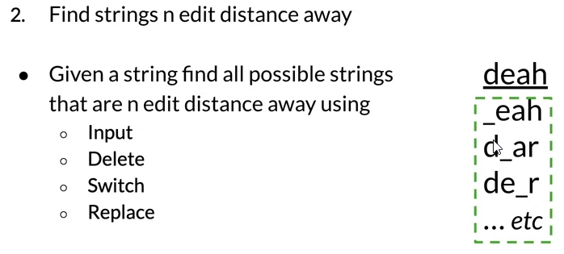
- Filter candidates:
  - From the list from step 2, consider only real and correct spelled word
  - if the edit word not in vocabualry ==> remove it from list of candidates
    - 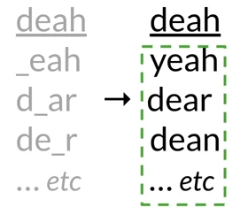
- Calculate word probabilities: the word candidate is the one with the highest probability
  - a word probablity in a corpus is: number of times the word appears divided by the total number of words.
    - 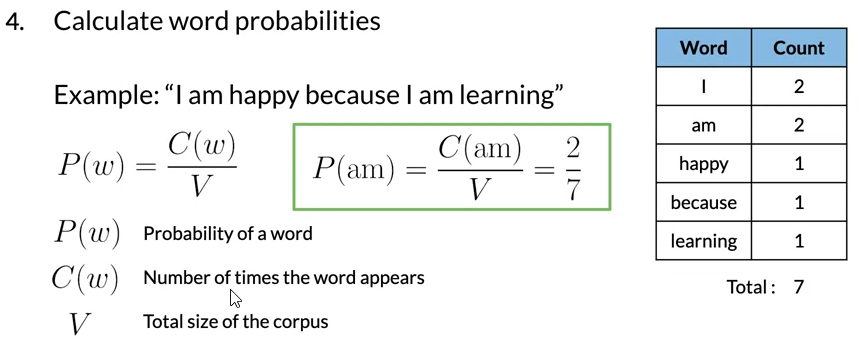

### Minimum edit distance

- Evaluate the similarity between 2 strings
- Minimum number of edits needed to transform 1 string into another
- the algorithm try to minimize the edit cost  
  - 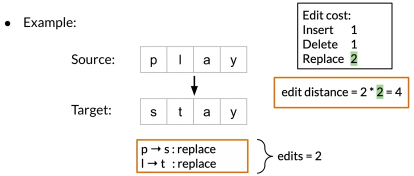
- Applications:
  - Spelling correction
  - document similarity
  - machine translation
  - DNA sequencing
  - etc

### Minimum edit distance algorithm

- The source word layed on the column
- The target word layed on the row
- Empty string at the start of each word at (0,0)
- D[i,j] is the minimum editing distance between the beginning of the source word to index i and the beginning of the target word to index j
  - 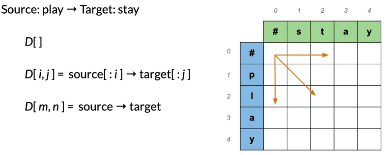
- To fillout the rest of the table we can use this formulaic approach:
  - 

## Part of Speech Tagging and Hidden Markov Models

[back to TOC](#table-of-contents)

### Part of Speech Tagging

- Part-of-speech refers to the category of words or the lexical terms in the language
  - tags can be: Noun, Verb, adjective, preposition, adverb,...
  - Example for the sentence: why not learn something ?
    - 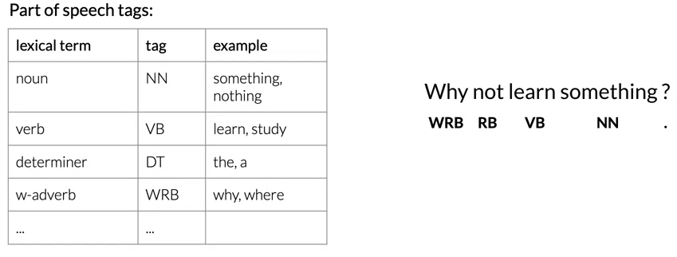
- Applications:
  - Named entities
  - Co-reference resolution
  - Speech recognition

### Markov Chains

- Markov chain can be depicted as a directed graph
  - a graph is a kind of data structure that is visually represented as a set of circles connected by lines.
- The circles of the graph represents states of our model
- The arraows from state s1 to s2 represents the transition probabilities, the likelihood to move from s1 to s2
  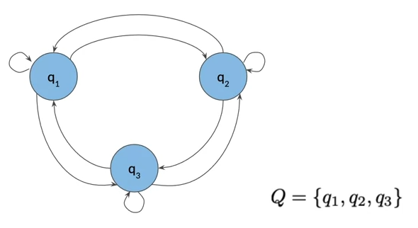

### Markov Chains and POS Tags

- Think about a sentence as a sequence of words with associated parts of speech tags
  - we can represent that sequence with a graph
  - where the parts of speech tags are events that can occur depicted by the states of the model graph.
  - the weights on the arrows between the states define the probability of going from one state to another
    - 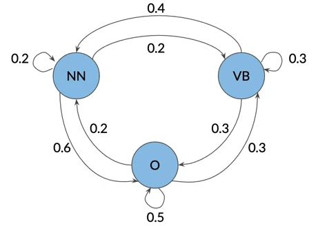  
- The probability of the next event only depends on the current events
- The model graph can be represented as a Transition matrix with dimension n+1 by n
  - when no previous state, we introduce an initial state π.
  - The sum of all transition from a state should always be 1.
    - 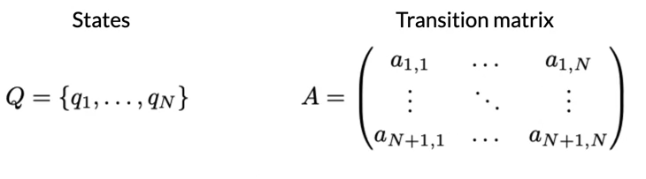

### Hidden Markov Chains models

- The hidden Markov model implies that states are hidden or not directly observable
- The hidden Markov model have a transition probability matrix A of dimensions (N+1,N) where N is number of hidden states
- The hidden Markov model have emission probabilities matrix B describe the transition from the hidden states to the observables(the words of your corpus)
  - the row sum of emission probabity for a hidden state is 1
  - 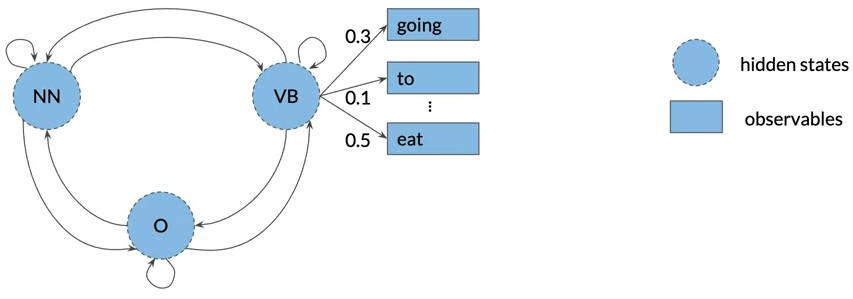

### The Transition Matrix

- Transition matrix holds all the transition probabilities between states of the Markov model
- $C(t_{i-1},t_i)$ count all occurrences of tag pairs in your training corpus
- $C(t_{i-1},t_{j})$ count all occurrences of tag $t_{i-1}$
  - 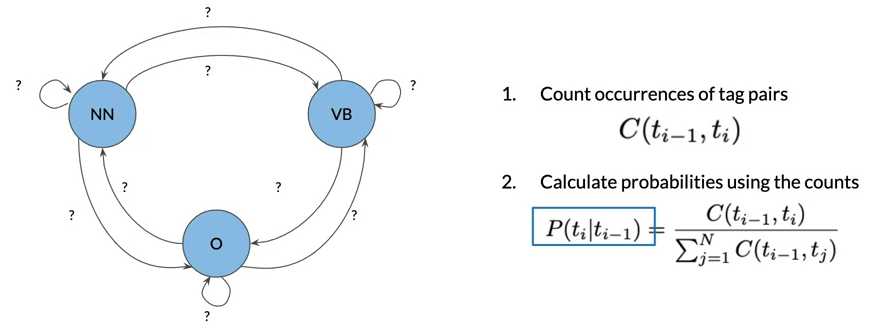
- 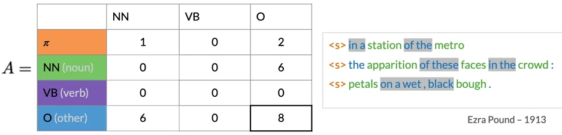
- to avoid division by zero and lot of entries in the transition matrix are zero, we apply smoothing to the probability formula
  - 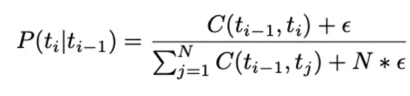

### The Emission  Matrix

- Count the co-occurrences of a part of speech tag with a specific word.
  - 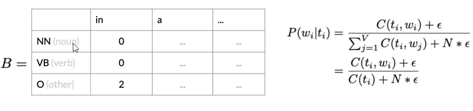

### The Viterbi Algorithm

- The Viterbi algorithm is actually a graph algorithm
- The goal is to to find the sequence of hidden states or parts of speech tags that have the highest probability for a sequence
  - 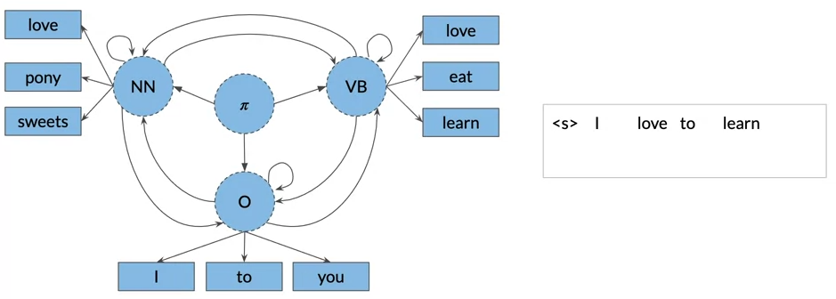
- The algorithm can be split into three main steps: the initialization step, the forward pass, and the backward pass.
- Given your transition and emission probabilities, we first populates and then use the auxiliary matrices C and D
  - matrix C holds the intermediate optimal probabilities
  - matrix D holds the indices of the visited states as we are traversing the model graph to find the most likely sequence of parts of speech tags for the given sequence of words, $W_{1}$ all the way to $W_{k}$.
  - C and D matrix have n rows (number of parts of speech tags) and k comlumns (number of words in the given sequence)

#### Initialization

- The initialization of matrix C tell the probability of every word belongs to a certain part of speech.
  - 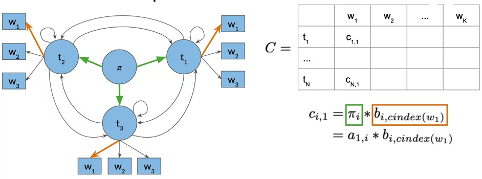
- in $D$ matrix, we store the labels that represent the different states we are traversing when finding the most likely sequence of parts of speech tags for the given sequence of words $W_{1}$ all the way to $W_{k}$.

#### Forward Pass

- For the $C$ matrix, the entries are calculated by this formula:
  - 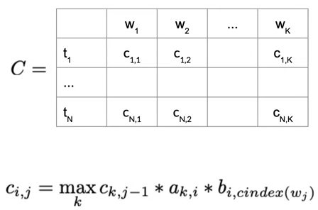
- For matrix D, save the k, which maximizes the entry in $c_{i,j}$.
  - 

#### Backward Pass

- The backward pass help retrieve the most likely sequence of parts of speech tags for your given sequence of words.
- First calculate the index of the entry, $C_{i,K}$, with the highest probability in the last column of $C$
  - represents the last hidden state we traversed when we observe the word $w_{i}$
- Use this index to traverse back through the matrix D to reconstruct the sequence of parts of speech tags
- multiply many very small numbers like probabilities leads to numerical issues
  - Use log probabilities instead where numbers are summed instead of multiplied.
  - 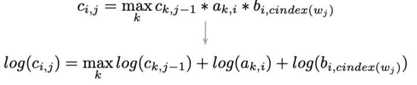

## Autocomplete and Language Models

[back to TOC](#table-of-contents)

### N-Grams

- A language model is a tool that's calculates the probabilities of sentences.
- Language models can estimate the probability of an upcoming word given a history of previous words.
- apply language models to autocomplete a given sentence then it outputs a suggestions to complete the sentence
- Applications:
  - Speech recognition
  - Spelling correction
  - Augmentativce communication

### N-grams and Probabilities

- N-gram is a sequence of words. N-grams can also be characters or other elements.
- 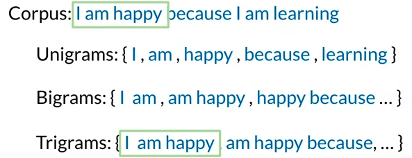
- Sequence notation:
  - m is the length of a text corpus
  - $W_{i}^{j}$ refers to the sequence of words from index $i$ to $j$ from the text corpus
- Uni-gram probability
  - 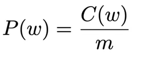
- Bi-gram probability
  - 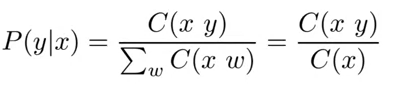
- N-gram probability
  - 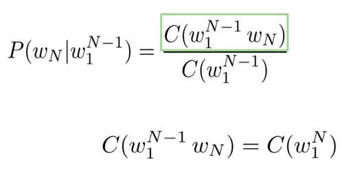

### Sequence Probabilities

- giving a sentence the Teacher drinks tea, the sentence probablity can be represented as based on conditional probability and chain rule:
  - 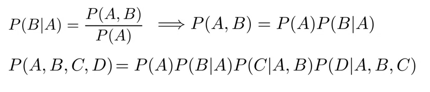
- this direct approach to sequence probability has its limitations, longer parts of your sentence are very unlikely to appear in the training corpus.
  - P(tea|the teacher drinks)
  - Since neither of them is likely to exist in the training corpus their counts are 0.
  - The formula for the probability of the entire sentence can't give a probability estimate in this situation.
- Approximation of sequence probability
  - Markov assumption: only last N words matter
  - Bigram $P(w_{n}| w_{1}^{n-1}) ≈ P(w_{n}| w_{n-1})$
  - Ngram $P(w_{n}| w_{1}^{n-1}) ≈ P(w_{n}| w_{n-N+1}^{n-1})$
  - Entire sentence modeled with Bigram:
    - 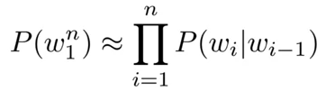

### Starting and Ending Sentences

- Start of sentence symbol: `<s>`
- End of sentence symbol: `</s>`

### The N-gram Language Model

- The count matrix captures the number of occurrences of relative n-grams
  - 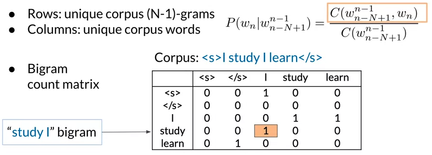
- Transform the count matrix into a probability matrix that contains information about the conditional probability of the n-grams.
  - 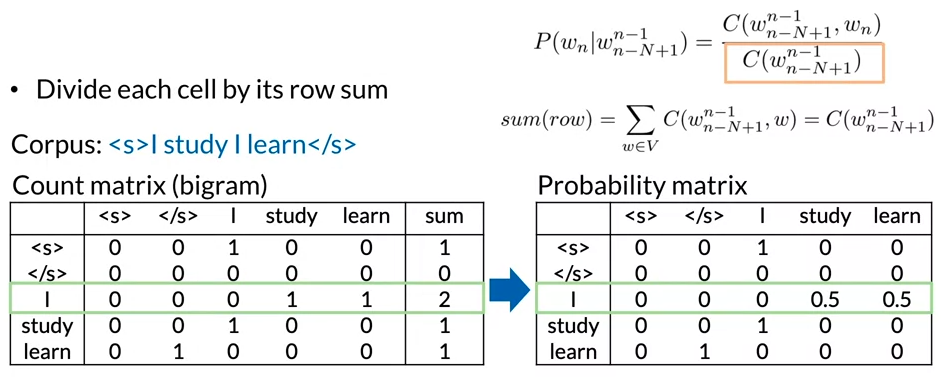
- Relate the probability matrix to the language model.
  - 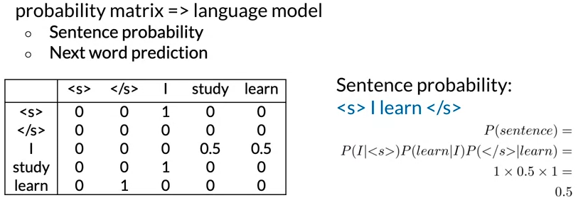
- Multiplying many probabilities brings the risk of numerical underflow,use the logarithm of a product istead to write the product of terms as the sum of other terms.

### Language Model evaluation

- In order to evaluate a Language model, split the text corpus into train (80%), validation (10%) and Test (10%) set.
- Split methods can be: continus text or Random short sequences
  - 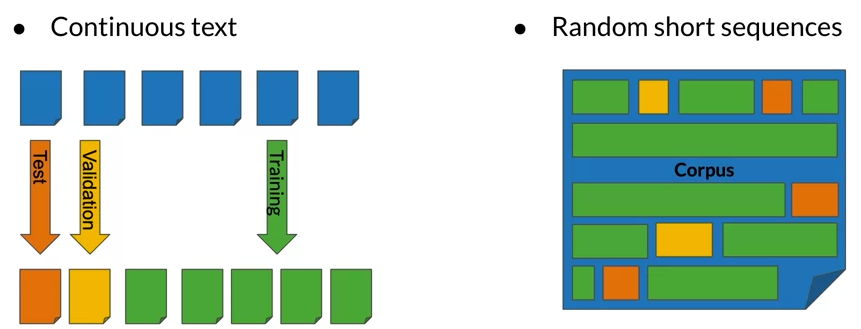
- Evaluate the language models using the perplexity metric
  - 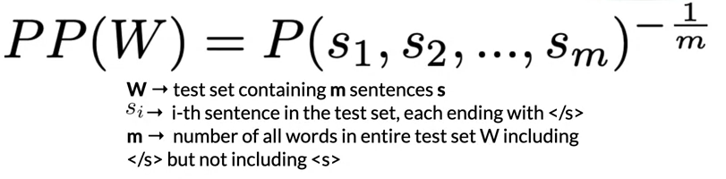
  - The smaller the perplexity, the better the model
  - Character level models PP is lower than word-based models PP
  - Perplexity for bigram models
    - 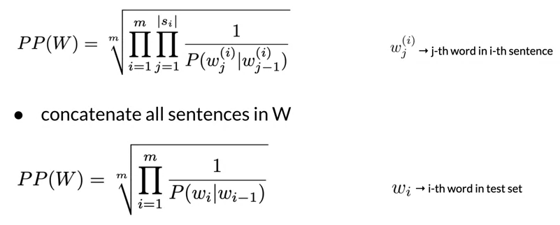
  - Log perplexity
    - 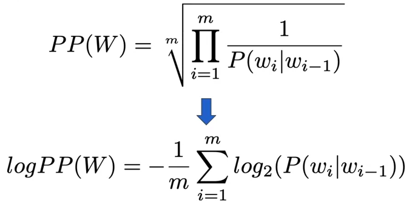

### Out of Vocabulary Words

- Unknown words are words not find the vocabuary.
  - model out of vocabulary words by a special word **UNK**.
  - any word in the corpus not in the vocabulary will be replaced by **UNK**

### Smoothing

- When we train n-gram on a limited corpus, the probabilities of some words may be skewed.
  - This appear when N-grams made of known words still might be missing in the training corpus
  - Their count can not be used for probability estimation
  - 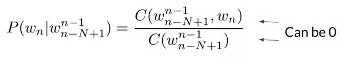
- Laplacian smoothing or Add-one smoothing
  - 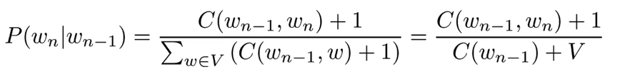
- Add-K smoothing
  - 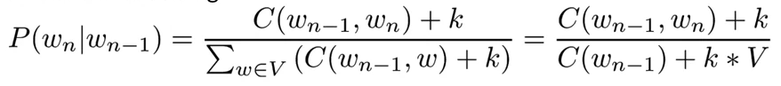
- BackOff:
  - If n-gram information is missing, we use N minus 1 gram.
  - If that's also missing, we would use N minus 2 gram and so on until we find non-zero probability
  - This method distorts the probability distribution. Especially for smaller corporal
  - Some probability needs to be discounted from higher level n-gram to use it for lower-level n-gram, e.g. Katz backoff
  - In very large web-scale corpuses, a method called **stupid backoff** has been effective.
    - With stupid backoff, no probability discounting is applied
    - If the higher order n-gram probability is missing, the lower-order n-gram probability is used multiplied by a constant **0.4**
    - P(chocolate| Jhon drinks) = 0.4 x P(chocolate| drinks)
- Linear interpolation of all orders of n-gram
  - Combine the weighted probability of the n-gram, N minus 1 gram down to unigrams.
  - 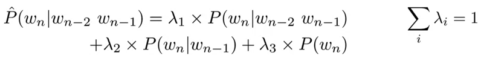

## Word embeddings with neural networks

[back to TOC](#table-of-contents)

### Basic Word Representations

- The simplest way to represent words as numbers is for a given vocabulary to assign a unique integer to each word
  - 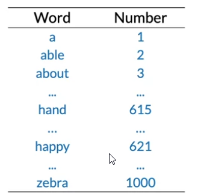
  - Although it's simple representation, it has little sementic sense
- One-Hot Vector representation
  - 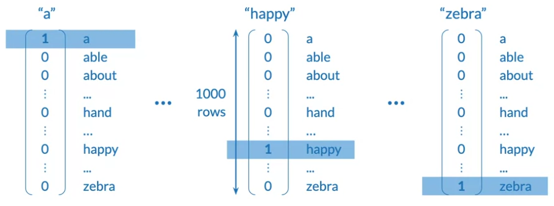
  - Although it's simple representation and not implied in ordering, but can be huge for computation and doesn't embed meaning

### Word Embeddings

- Word embeddings are vectors that's carrying meaning with relatively low dimension
  - 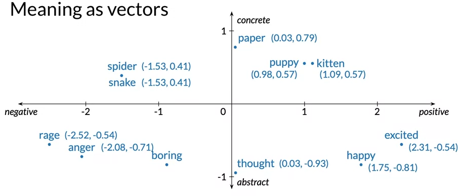
- To create a word embeddings you need a corpus of text and an embedding method
  - 

### Word Embedding Methods

- Word2vec: which initially popularized the use of machine learning, to generate word embeddings
  - Word2vec uses a shallow neural network to learn word embeddings
  - It proposes two model architectures,
    1. Continuous bag of words(CBOW) which predict the missing word just giving the surround word
    2. Countinuous skip-gram/ skip-gram with negative sampling(SGNS) which does the reverse of the CBOW method, SGNS learns to predict the word surrounding a given input word
- GloVe: involves factorizing the logarithm of the corpuses word co-occurrence matrix, similarly to the counter matrix
- fastText:  based on the skip-gram model and takes into account the structure of words by representing words as an n-gram of characters.
  - This enables the model to support previously unseen words, known as outer vocabulary words(OOV), by inferring their embedding from the sequence of characters they are made of, and the corresponding sequences that it was initially trained on.
  - Word embedding vectors can be averaged together to make vector representations of phrases and sentences.
- Other examples of advanced models that generate word embeddings are: BERT,GPT-2,ELMo

### Continuous Bag-of-Words Model

- CBOW is ML-based embedding methods that try to predict a missing word based on the surrounding words.
- The rationale is that if two unique words are both frequently surrounded by a similar sets of words when used in various sentences => those two words tend to be related semantically.
- To create training data for the prediction task, we need set of example of context words and center words
  - 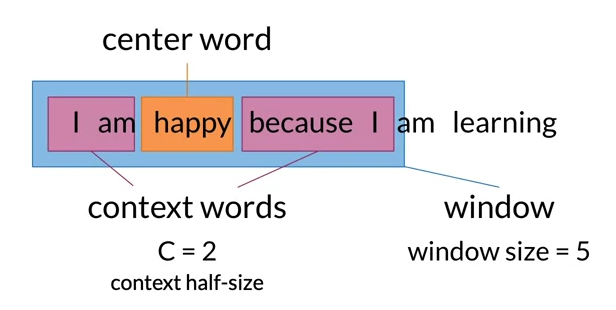
  - by sliding the window, you creating the next traing example and the target center word
  - 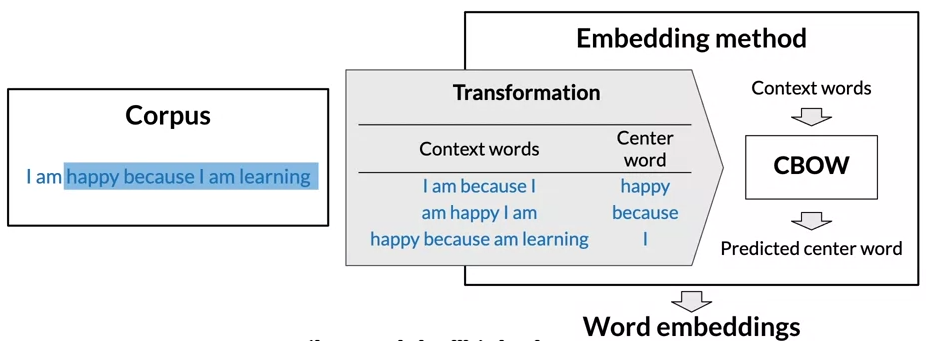

### Cleaning and Tokenization

- We should consider the words of your corpus as case insensitive, The==THE==the
- Punctuation: represents ? . , ! and other characters as a single special word of the vocabulary
- Numbers: if numbers not caring meaning in your use-case, we can drop them or keep them (its possible to replace them with special token `<NUMBER>`)
- Special characters: math/ currency symbols, paragraph signs
- Special words: emojis, hashtags

### Transforming Words into Vectors

- This done by transforming centeral and context word into one-hot vectors
- Final prepared training set is:
  - 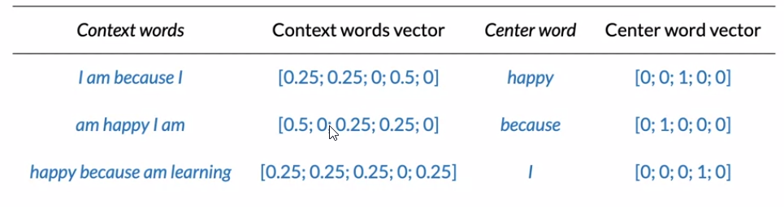

### Architecture of the CBOW Model

- The Continuous Bag of Words model is based on the shallow dense neural network with an input layer, a single hidden layer, and output layer.
- 

### CBOW Model Dimensions

- 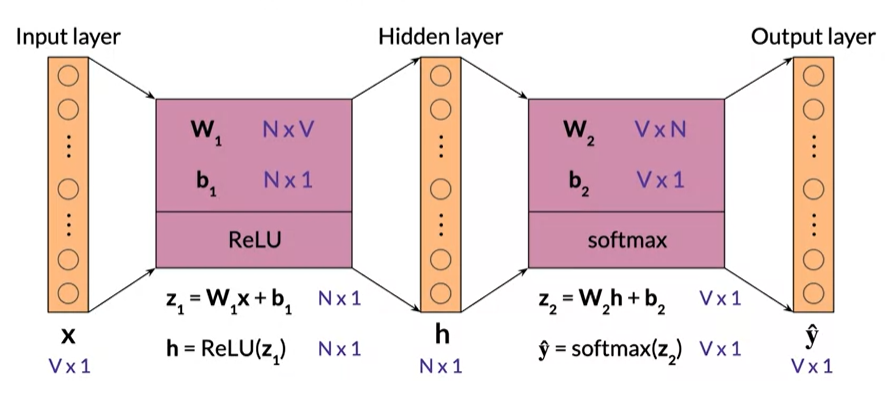
- 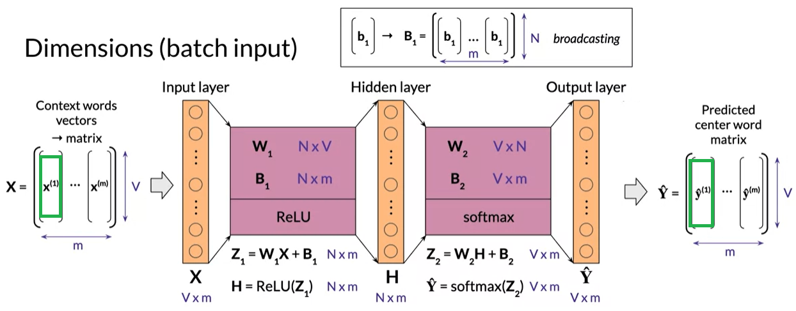

### Activation Functions

- 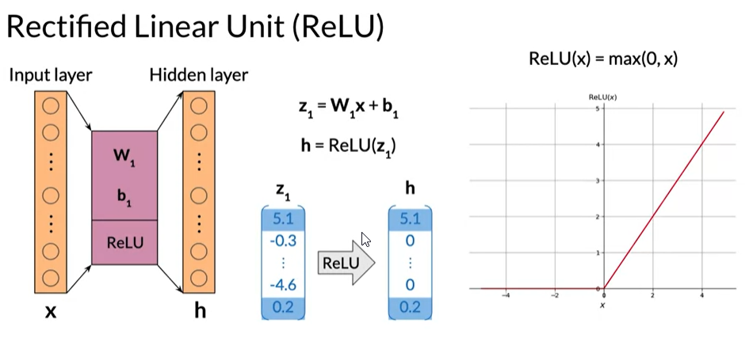
- 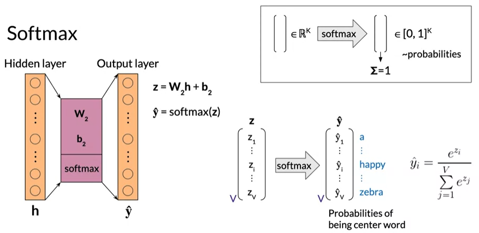

### Cost Functions

- The objective of the learning process is to find the parameters that minimize the loss given the training data sets using the cross-entropy loss
- 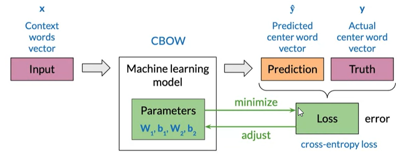
- 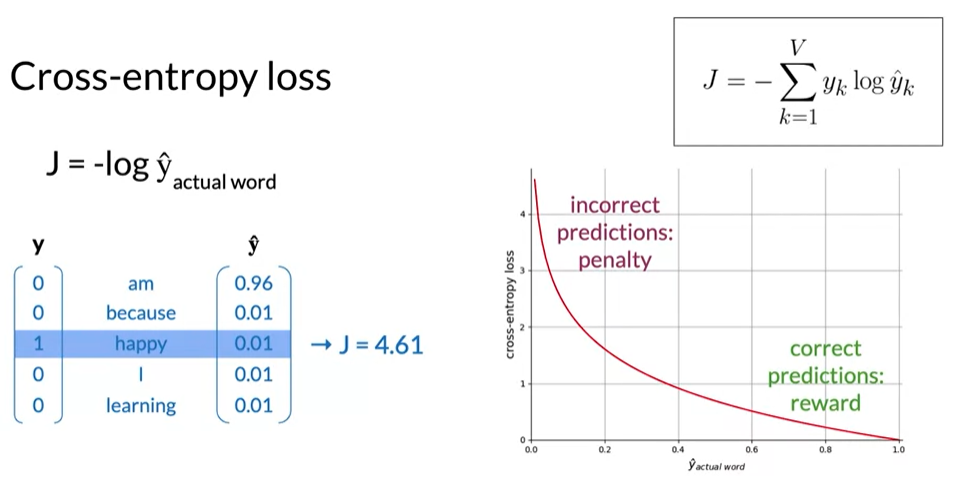

### Forward Propagation

- 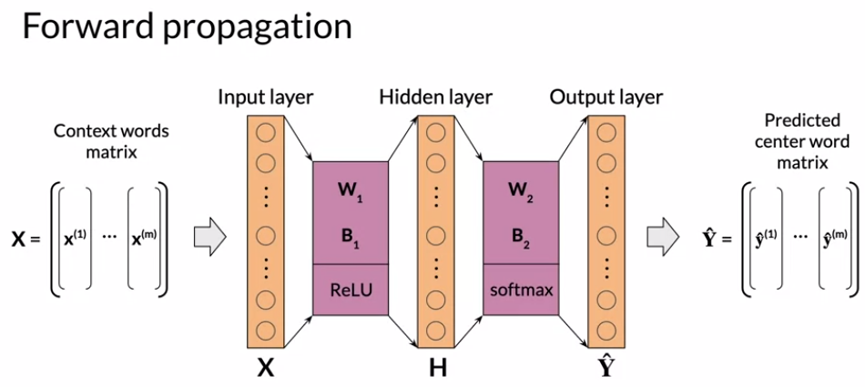
- 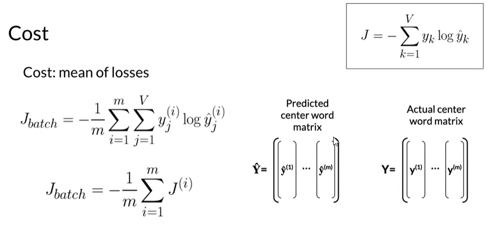

#### Backpropagation and Gradient Descent

Backpropagation calculate the partial derivatives of cost with respect to weights and biases
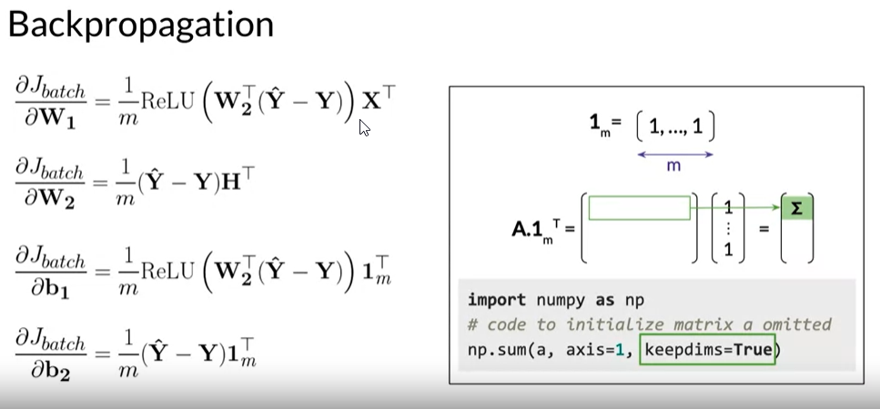

Gradient descent update weights and biases
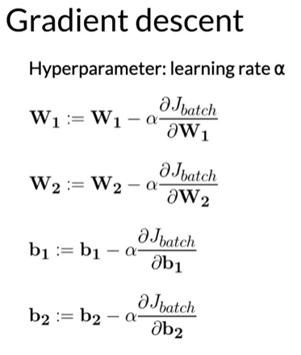

#### Extracting Word Embedding Vectors

- After we have trained the neural network, we can extract three alternative word embedding representations
  1. consider each column of W_1 as the column vector embedding vector of a word of the vocabulary
  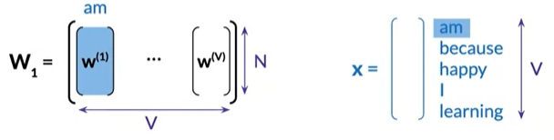
  2. use each row of W_2 as the word embedding row vector for the corresponding word.
  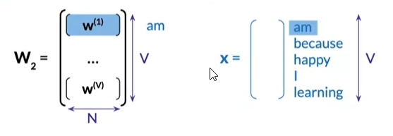
  3. average W_1 and the transpose of W_2 to obtain W_3, a new n by v matrix.
  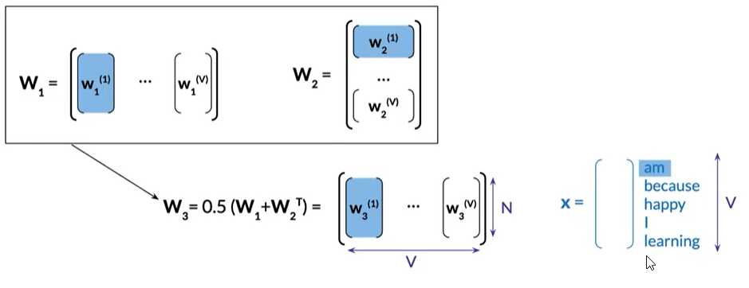

### Evaluating Word Embeddings

#### Intrinsic Evaluation

- Intrinsic evaluation methods assess how well the word embeddings inherently capture the semantic(meaning) or syntactic(grammar) relationships between the words.
- Test on semantic analogies
  - 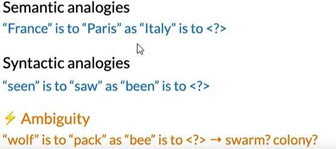
- Using a clustering algorithm to group similar word embedding vectors, and determining of the cluster's capture related words
  - 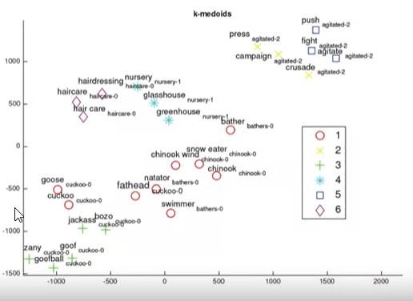
  - 

#### Extrinsic Evaluation

- Test the word embeddings to perform an external task, Named Entity recognition, POS tagging
- Evaluate this classifier on the test set with some selected evaluation metric, such as accuracy or the F1 score.
- The evaluation will be more time-consuming than an intrinsic evaluation and more difficult to troubleshoot.
