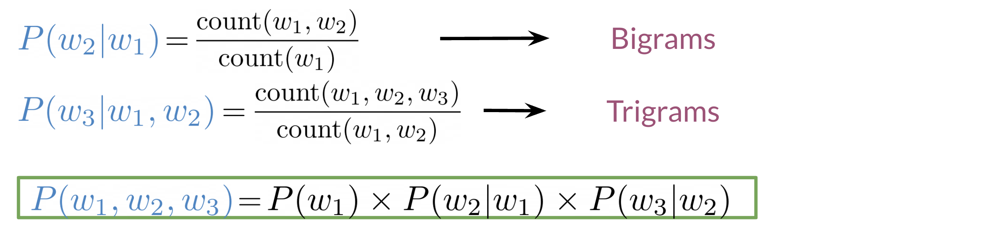
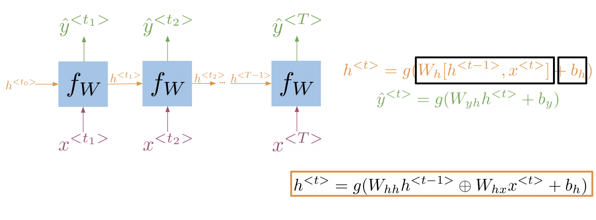
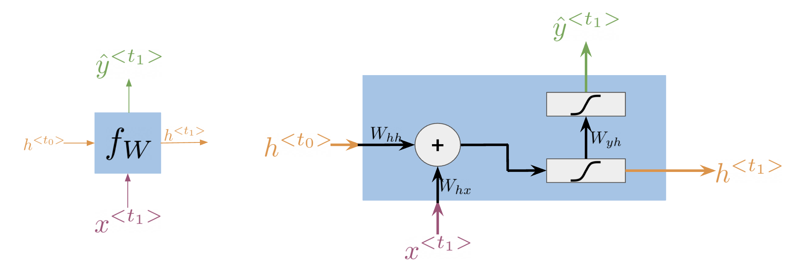
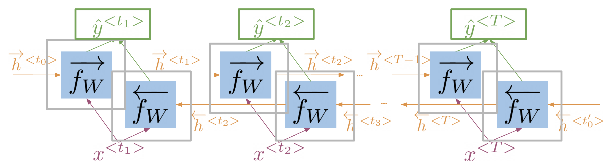

# NLP with Sequence Models

## Table of contents

- [Table of contents](#table-of-contents)
- [About this course](#about-this-course)
- [Neural Networks for Sentiment Analysis](#neural-networks-for-sentiment-analysis)
- [Trax: Neural Networks](#trax-neural-networks)
- [Reading: (Optional) Trax and JAX, docs and code](#reading-optional-trax-and-jax-docs-and-code)
- [Classes, subclasses and inheritance](#classes-subclasses-and-inheritance)
- [Dense and ReLU layer](#dense-and-relu-layer)
- [Serial Layer](#serial-layer)
- [Other Layers](#other-layers)
- [Training](#training)
- [Traditional Language models](#traditional-language-models)
- [Recurrent Neural Networks](#recurrent-neural-networks)
- [Application of RNNs](#application-of-rnns)
- [Math in Simple RNNs](#math-in-simple-rnns)
- [Cost Function for RNNs](#cost-function-for-rnns)
- [Implementation Note](#implementation-note)
- [Gated Recurrent Units](#gated-recurrent-units)
- [Deep and Bi-directional RNNs](#deep-and-bi-directional-rnns)

## About this course

[back to TOC](#table-of-contents)

In Course 3 of the [Natural Language Processing Specialization](https://www.coursera.org/specializations/natural-language-processing), you will:

1. Train a neural network with GLoVe word embeddings to perform sentiment analysis of tweets,
2. Generate synthetic Shakespeare text using a Gated Recurrent Unit (GRU) language model,
3. Train a recurrent neural network to perform named entity recognition (NER) using LSTMs with linear layers, and
4. Use so-called ‘Siamese’ LSTM models to compare questions in a corpus and identify those that are worded differently but have the same meaning.

By the end of this Specialization, you will have designed NLP applications that perform question-answering and sentiment analysis, created tools to translate languages and summarize text, and even built a chatbot!

This Specialization is designed and taught by two experts in NLP, machine learning, and deep learning. Younes Bensouda Mourri is an Instructor of AI at Stanford University who also helped build the Deep Learning Specialization. Łukasz Kaiser is a Staff Research Scientist at Google Brain and the co-author of Tensorflow, the Tensor2Tensor and Trax libraries, and the Transformer paper.

## Neural Networks for Sentiment Analysis

[back to TOC](#table-of-contents)

Previously in the course you did sentiment analysis with logistic regression and naive Bayes. Those models were in a sense more naive, and are not able to catch the sentiment off a tweet like: "I am not happy " or "If only it was a good day". When using a neural network to predict the sentiment of a sentence, you can use the following. Note that the image below has three outputs, in this case you might want to predict, "positive", "neutral ", or "negative".

Note that the network above has three layers. To go from one layer to another you can use a WW matrix to propagate to the next layer. Hence, we call this concept of going from the input until the final layer, forward propagation. To represent a tweet, you can use the following:

Note, that we add zeros for padding to match the size of the longest tweet.

## Trax: Neural Networks

[back to TOC](#table-of-contents)

**Trax** has several advantages:

- Runs fast on CPUs, GPUs and TPUs
- Parallel computing
- Record algebraic computations for gradient evaluation

Here is an example of how you can code a neural network in Trax:

## Reading: (Optional) Trax and JAX, docs and code

[back to TOC](#table-of-contents)

Official Trax documentation maintained by the Google Brain team:

<https://trax-ml.readthedocs.io/en/latest/>

Trax source code on GitHub:

<https://github.com/google/trax>

JAX library:

<https://jax.readthedocs.io/en/latest/index.html>

## Classes, subclasses and inheritance

[back to TOC](#table-of-contents)

Trax makes use of classes. If you are not familiar with classes in python, don't worry about it, here is an example.

In the example above, you can see that a class  takes in an **init** and a **call** method. These methods allow you to initialize your internal variables and allow you to execute your function when called. To the right you can see how you can initialize your class. When you call MyClass(7) , you are setting the y variable to 7. Now when you call f(3) you are adding 7 + 3. You can change the my_method function to do whatever you want, and you can have as many methods as you want in a class.  

## Dense and ReLU layer

[back to TOC](#table-of-contents)

The Dense layer is the computation of the inner product between a set of trainable weights (weight matrix) and an input vector.  The visualization of the dense layer could be seen in the image below.

The orange box shows the dense layer. An activation layer is the set of blue nodes. Concretely one of the most commonly used activation layers is the rectified linear unit (ReLU).

ReLU(x) is defined as max(0,x) for any input x.

## Serial Layer

[back to TOC](#table-of-contents)

A serial layer allows you to compose layers in a serial arrangement:

It is a composition of sublayers. These layers are usually dense layers followed by activation layers.

## Other Layers

[back to TOC](#table-of-contents)

Other layers could include embedding layers and mean layers. For example, you can learn word embeddings for each word in your vocabulary as follows:

The mean layer allows you to take the average of the embeddings. You can visualize it as follows:

This layer does not have any trainable parameters.

## Training

[back to TOC](#table-of-contents)

In Trax, the function grad allows you to compute the gradient. You can use it as follows:

Now if you were to evaluate grad_f at a certain value, namely z, it would be the same as computing 6z+1.  Now to do the training, it becomes very simple:

You simply compute the gradients by feeding in y.forward (the latest value of y), the weights, and the input x, and then it does the back-propagation for you in a single line. You can then have the loop that allows you to update the weights (i.e. gradient descent!).

## Traditional Language models

[back to TOC](#table-of-contents)

Traditional language models make use of probabilities to help identify which sentence is most likely to take place.

In the example above, the second sentence is the one that is most likely to take place as it has the highest probability of happening. To compute the probabilities, you can do the following:

Large N-grams capture dependencies between distant words and need a lot of space and RAM. Hence, we resort to using different types of alternatives.

## Recurrent Neural Networks

[back to TOC](#table-of-contents)

Previously, we tried using traditional language models, but it turns out they took a lot of space and RAM.  For example, in the sentence below:

An N-gram (trigram) would only look at "did not" and would try to complete the sentence from there. As a result, the model will not be able to see the beginning of the sentence "I called her but she". Probably the most likely word is have after "did not". RNNs help us solve this problem by being able to track dependencies that are much further apart from each other. As the RNN makes its way through a text corpus, it picks up some information as follows:

Note that as you feed in more information into the model, the previous word's retention gets weaker, but it is still there. Look at the orange rectangle above and see how it becomes smaller as you make your way through the text. This shows that your model is capable of capturing dependencies and remembers a previous word although it is at the beginning of a sentence or paragraph. Another advantage of RNNs is that a lot of the computation shares parameters.

## Application of RNNs

[back to TOC](#table-of-contents)

RNNs could be used in a variety of tasks ranging from machine translation to caption generation. There are many ways to implement an RNN model:

- One to One: given some scores of a championship, you can predict the winner.
- One to Many: given an image, you can predict what the caption is going to be.
- Many to One: given a tweet, you can predict the sentiment of that tweet.
- Many to Many: given an english sentence, you can translate it to its German equivalent.

In the next video, you will see the math in simple RNNs.

## Math in Simple RNNs

[back to TOC](#table-of-contents)

It is best to explain the math behind a simple RNN with a diagram:

Note that:

$$h^{<t>} = g(W_h[ h^{<t-1>}, x^{<t>}] + b_h)$$

Is the same as multiplying $W_{hh}$ by $h$ and $W_{hx}$ by $x$. In other words, you can concatenate it as follows:

$$h^{<t>}=g\left(W_{h h} h^{<t-1>} \oplus W_{h x} x^{<t>}+b_{h}\right)$$

For the prediction at each time step, you can use the following:

$$\hat{y}^{<t>}=g\left(W_{y h} h^{<t>}+b_{y}\right)$$

Note that you end up training $W_{h h}, W_{hx }, W_{y h}, b_h, b_y$. Here is a visualization of the model.

## Cost Function for RNNs

[back to TOC](#table-of-contents)

The cost function used in an RNN is the cross entropy loss. If you were to visualize it

you are basically summing over the all the classes and then multiplying $y_j$ times $\log \hat y_j$. If you were to compute the loss over several time steps, use the following formula:

$$J=-\frac{1}{T} \sum_{t=1}^{T} \sum_{j=1}^{K} y_{j}^{<t>} \log \hat{y}_{j}^{<t>}$$

Note that we are simply summing over all the time steps and dividing by $T$, to get the average cost in each time step. Hence, we are just taking an average through time.

## Implementation Note

[back to TOC](#table-of-contents)

The scan function is built as follows:

Note, that is basically what an RNN is doing. It takes the initializer, and returns a list of outputs (ys), and uses the current value, to get the next y and the next current value. These type of abstractions allow for much faster computation.

## Gated Recurrent Units

[back to TOC](#table-of-contents)

Gated recurrent units are very similar to vanilla RNNs, except that they have a "relevance" and "update" gate that allow the model to update and get relevant information. I personally find it easier to understand by looking at the formulas:

To the left, you have the diagram and equations for a simple RNN. To the right, we explain the GRU. Note that we add 3 layers before computing h and y.

$$\begin{aligned} \Gamma_{u} &=\sigma\left(W_{u}\left[h^{<t_{0}>}, x^{<t_{1}>}\right]+b_{u}\right) \\ \Gamma_{r} &=\sigma\left(W_{r}\left[h^{<t_{0}>}, x^{<t_{1}>}\right]+b_{r}\right) \\ h^{\prime<t_{1}>}=& \tanh \left(W_{h}\left[\Gamma_{r} * h^{<t_{0}>}, x^{<t_{1}>}\right]+b_{h}\right) \end{aligned}$$

The first gate $\Gamma_{u}$ allows you to decide how much you want to update the weights by. The second gate  $\Gamma_{r}$, helps you find a relevance score. You can compute the new $h$ by using the relevance gate. Finally you can compute $h$, using the update gate. GRUs “decide” how to update the hidden state. GRUs help preserve important information.

## Deep and Bi-directional RNNs

[back to TOC](#table-of-contents)

Bi-directional RNNs are important, because knowing what is next in the sentence could give you more context about the sentence itself.

So you can see, in order to make a prediction $\hat y$, you will use the hidden states from both directions and combine them to make one hidden state, you can then proceed as you would with a simple vanilla RNN. When implementing Deep RNNs, you would compute the following.  

Note that at layer $l$, you are using the input from the bottom $a^{[l-1]}$ and the hidden state $h^l$. That allows you to get your new h, and then to get your new a, you will train another weight matrix $W_a$, which you will multiply by the corresponding h add the bias and then run it through an activation layer.
